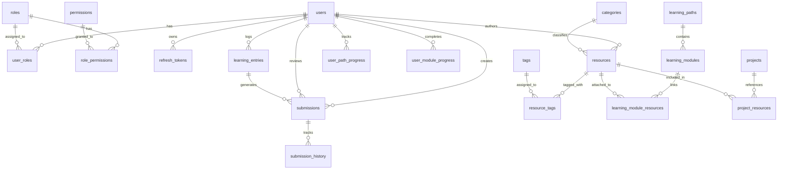

# Database Architecture & Entity Relationships

The platform utilizes a relational database structure designed for PostgreSQL (with SQLite compatibility for fast local testing).

## Entity Relationship Overview

## Schema Definitions

1. **`users`**: Corporate identity, hashed password (bcrypt), designation, department, active status.
2. **`roles`**: Named roles (`ADMIN`, `MENTOR`, `EMPLOYEE`).
3. **`permissions`**: Granular permissions (`knowledge:read`, `submission:review`, etc.).
4. **`user_roles` & `role_permissions`**: Many-to-many junction tables.
5. **`refresh_tokens`**: Opaque rotated refresh tokens with expiry and revocation flags.
6. **`categories` & `tags`**: Flexible content taxonomy.
7. **`resources`**: Multitype assets (`DOCUMENT`, `PRESENTATION`, `PDF`, `ARCHITECTURE`, `VIDEO`, etc.) with view and download counters.
8. **`learning_paths` & `learning_modules`**: Structured curriculum trees with progress tracking.
9. **`user_path_progress` & `user_module_progress`**: Individual milestone completion and percentage calculations.
10. **`learning_entries`**: Daily journal entries with date, learnings, and deliverables.
11. **`submissions` & `submission_history`**: Capstone and exercise submissions with reviewer feedback.
12. **`projects`**: Internal system architectures, tech stacks, and repository references.
13. **`audit_logs`**: Immutable security and mutation event trail.
